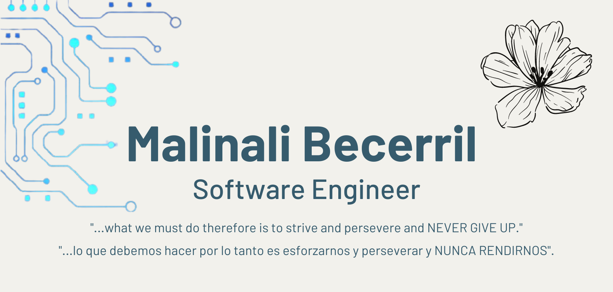

 

	
	 
	   

### Hi there 👋

- 🔭 I’m currently working on devf
- 🌱 I’m currently learning cibersecurity, my carrear and softskills.
- 👯 I’m looking to collaborate on STEM programs.
- 💬 Ask me about JS, Java, Elixir and computer science concepts.
- 😄 Pronouns: she / her
<!--
**malibb/malibb** is a ✨ _special_ ✨ repository because its `README.md` (this file) appears on your GitHub profile.

Here are some ideas to get you started:

- 🔭 I’m currently working on ...
- 🌱 I’m currently learning ...
- 👯 I’m looking to collaborate on ...
- 🤔 I’m looking for help with ...
- 💬 Ask me about ...
- 📫 How to reach me: ...
- 😄 Pronouns: ...
- ⚡ Fun fact: ...
-->
